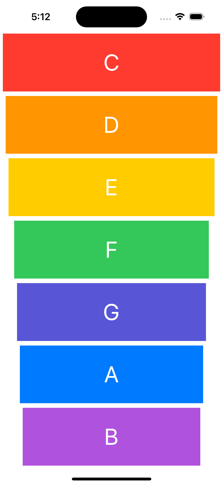

The Xylophone App built with UIKit and AVFoundation (AVA) is a fun and interactive music app that allows users to play different musical notes by tapping on colorful keys. It demonstrates how sound and visuals can be combined using Swift and UIKit components.

Key Features of Xylophone App:
Interactive Keys: Users can tap on colorful xylophone bars, each playing a different note.
AVFoundation Integration: Utilizes AVFoundation to load and play sound files smoothly.
UIKit Components: Uses UIButton or custom views to represent each xylophone key.
Sound Playback: Every tap triggers the playback of corresponding sound notes.
Responsive UI: Includes smooth animations when keys are tapped to enhance the experience.
Use Cases:
Entertainment: A simple and fun way for kids or adults to play with music.
Learning Music: Helps users learn basic notes and sounds interactively.
Practice Project: A great way to explore UIKit and AVFoundation for handling sound in iOS apps.
In summary, the Xylophone App combines UIKit and AVFoundation to create an engaging, musical experience. It serves as a fun learning tool for both music enthusiasts and developers interested in working with audio and UI components in Swift.

